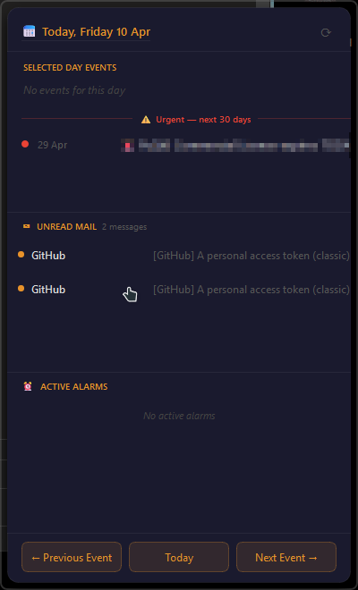
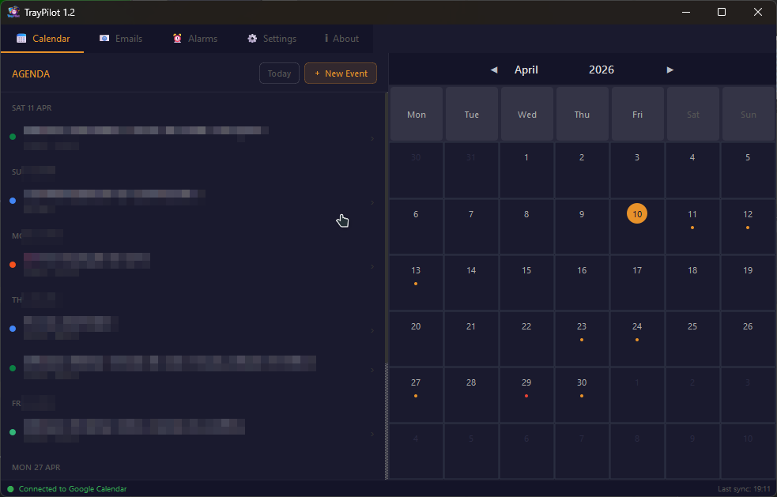
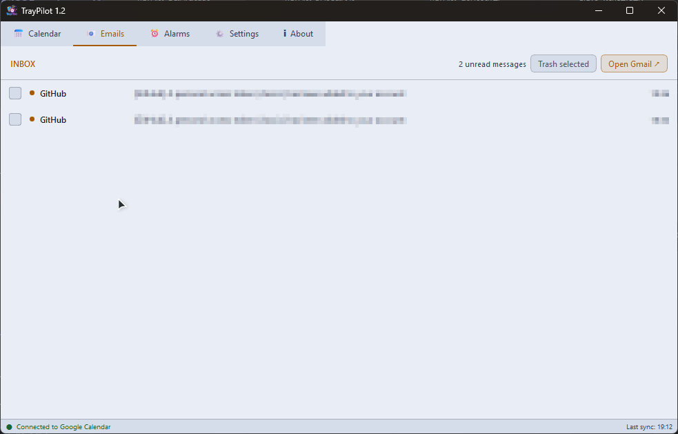
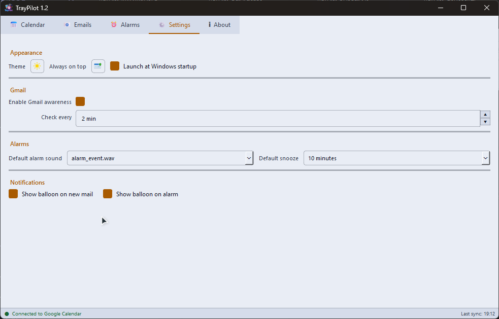

# TrayPilot

A lightweight Windows system tray app for Google Calendar and Gmail — built with PyQt6.

Single-click the tray icon for a quick popup of today's events, unread mail, and active alarms. Double-click to open the full window with calendar, inbox, alarms, and settings.


---

## Screenshots

| Tray Popup | Calendar |
|:---:|:---:|
|  |  |

| Emails | Settings |
|:---:|:---:|
|  |  |

---

## Features

- **Calendar** — view, create, edit, and delete Google Calendar events
- **Gmail** — unread inbox awareness, read messages, trash from the tray
- **Alarms** — standalone and calendar-linked alarms with audio and snooze
- **Dark/light theme** — with persistent preference
- **Windows startup** — optional launch at login via registry

---

## Requirements

- Windows 10/11
- Python 3.13+
- A Google Cloud project with Calendar and Gmail APIs enabled

---

## Setup

### 1. Clone the repo

```
git clone https://github.com/mnprojects/traypilot.git
cd traypilot
```

### 2. Create a virtual environment and install dependencies

```
python -m venv venv
venv\Scripts\activate
pip install -r requirements.txt
```

### 3. Get Google API credentials

1. Go to [Google Cloud Console](https://console.cloud.google.com/)
2. Create a new project (or use an existing one)
3. Enable the **Google Calendar API** and **Gmail API**
4. Go to **APIs & Services → Credentials**
5. Create an **OAuth 2.0 Client ID** → Desktop app
6. Download the JSON file and rename it `credentials.json`
7. Place it in:

```
%LOCALAPPDATA%\mn-projects\TrayPilot\credentials.json
```

On first launch, a browser window will open for Google sign-in. After approval, the token is saved automatically — you won't need to sign in again.

### 4. Run

```
python main.py
```

---

## Build (optional)

To compile your own executable with PyInstaller:

```
pip install pyinstaller
pyinstaller TrayPilot.spec
```

The output will be in `dist/TrayPilot/`.

---

## License

GNU General Public License v3.0 — see [LICENSE](LICENSE) for details.

---

## Author

Martinho Costa Neves — [mn-projects.eu](https://mn-projects.eu)
